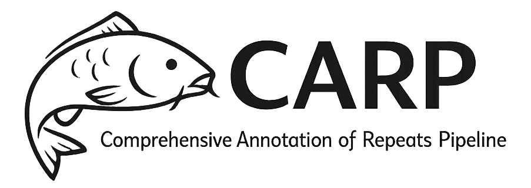

The Comprehensive Annotation of Repeats Pipeline (CARP) is a
workflow that
integrates multiple specialized tools to identify and classify various types of repetitive
elements in genomic sequences. 

- The pipeline uses DANTE/DANTE_LTR to identify intact
LTR retrotransposons.
- DANTE_TIR is used to identify DNA transposons
- DANTE_LINE is used to identify LINE elements.
- TideCluster is employed to identify tandem repeats, with separate processes
for default-length and short monomer repeats.
- The pipeline then creates custom libraries of repeat sequences, including those from LTR
retrotransposons and Tandem repeats. This library can be supplements with user-provided
custom repeat databases.
- After building these repeat libraries, the pipeline uses RepeatMasker to annotate the
genome comprehensively. 
- The workflow produces detailed GFF3 annotation files for
different repeat classes (mobile elements, simple repeats, low complexity regions, rDNA),
density visualizations as bigWig files, and summary statistics and plots.

## Requirements 
Singularity is required to use the container. Singularity can be installed using conda environment. 

```bash
conda create -n singularity3 -c conda-forge "singularity>=3.6"
conda activate singularity3
```

## Quick Start
Singularity image (.sif file) can be downloaded from https://github.com/kavonrtep/assembly_repeat_annotation_pipeline/releases

Format of `config.yaml` file is as follows:

```yaml
genome_fasta: data/CEN6_ver_220406_part.fasta
output_dir: output
custom_library: data/pisum_custom_library.fasta
tandem_repeat_library: data/FabTR_all_sequences_210901.db.RM_format.fasta
# posible values are : sensitive, default, quick,
# if missing, default is used
repeatmasker_sensitivity: default
# perform library size reduction, possible values are True, False, if missinf True is used
reduce_library: True  
```

The pipeline allows providing the custom repeat library by specifying
the `custom_library` parameter. This parameter is optional.
This library is used by RepeatMasker for similarity-based annotation. The sequences must
be in FASTA format with sequence IDs in the format `>repeatname#class/subclass`. The
classification categories used by the pipeline are listed below.

```text
Class_I/LINE
Class_I/LTR/Ty1_copia
Class_I/LTR/Ty1_copia/Ale
Class_I/LTR/Ty1_copia/Angela
Class_I/LTR/Ty1_copia/Bianca
Class_I/LTR/Ty1_copia/Ikeros
Class_I/LTR/Ty1_copia/Ivana
Class_I/LTR/Ty1_copia/SIRE
Class_I/LTR/Ty1_copia/TAR
Class_I/LTR/Ty1_copia/Tork
Class_I/LTR/Ty1_copia/Alexandra
Class_I/LTR/Ty1_copia/Bryana
Class_I/LTR/Ty1_copia/Ferco
Class_I/LTR/Ty3_gypsy
Class_I/LTR/Ty3_gypsy/chromovirus
Class_I/LTR/Ty3_gypsy/chromovirus/Ferney
Class_I/LTR/Ty3_gypsy/chromovirus/CRM
Class_I/LTR/Ty3_gypsy/chromovirus/Reina
Class_I/LTR/Ty3_gypsy/chromovirus/Tekay
Class_I/LTR/Ty3_gypsy/non-chromovirus/OTA
Class_I/LTR/Ty3_gypsy/non-chromovirus/OTA/Tatius
Class_I/LTR/Ty3_gypsy/non-chromovirus/OTA/Athila
Class_I/LTR/Ty3_gypsy/non-chromovirus/OTA/Tat
Class_I/LTR/Ty3_gypsy/non-chromovirus/OTA/Tat/Ogre
Class_I/LTR/Ty3_gypsy/non-chromovirus/OTA/Tat/Retand
Class_II/Subclass_1/TIR/EnSpm_CACTA
Class_II/Subclass_1/TIR/hAT
Class_II/Subclass_1/TIR/MITE
Class_II/Subclass_1/TIR/MITE/Stowaway
Class_II/Subclass_1/TIR/MuDR_Mutator
Class_II/Subclass_1/TIR/PIF_Harbinger
Class_II/Subclass_1/TIR/Tc1_Mariner
Class_II/Subclass_2/Helitron
rDNA_45S/18S
rDNA_45S/25S
rDNA_45S/5.8S
rDNA_5S/5S
```

An important feature of pipeline is the filtering process where
`Class_II/Subclass_1` repeats from the custom library are used to screen the LTR
retrotransposon library created by DANTE_LTR. This critical step identifies potentially
problematic Class_I sequences - if a `Class_I` sequence shows similarity to
`Class_II/Subclass_1` elements, it likely represents an LTR retrotransposon that contains
inserted DNA transposons. Such composite elements are removed from the library to prevent
incorrect or ambiguous annotations when RepeatMasker is applied later in the pipeline.

File `tandem_repeat_library` (optional) is used by TideCluster to annotate discovered tandem repeats based
on the similarity. Format is the same as the above repeat database. E.g. 
`>sequence_id/Satellite/PisTR-B`

To run an annotation pipeline, execute the following command:

```bash
singularity run -B /path/to/ -B $PWD assembly_repeat_annotation_pipeline.sif -c config.yaml -t 20
```
Parameter `-t` specifies the number of threads to use. Singularity parameter `-B` is used to bind the input and output directories to the container. Without this parameter, the container will not be able to access the input and output files. File `config.yaml` must be also in directory which is accessible to the container. In the example above this is the current directory `$PWD`. 


## Running pipeline on metacentrum
Use [./scripts/annotate_repeats_metacentrum.sh](./scripts/annotate_repeats_metacentrum.sh) script to run the pipeline on metacentrum. Adjust paths to the input files , output directory and singularity image. 


## Output structure

The pipeline generates a structured output directory with the following key files and subdirectories:

### Top-level Output Files (Symlinks)

Main annotation files for easy access:
- `DANTE_filtered.gff3` - Filtered DANTE protein domain annotations
- `DANTE_LTR.gff3` - Complete LTR retrotransposons identified by DANTE_LTR
- `DANTE_TIR.gff3` - DNA transposons with Terminal Inverted Repeats
- `Tandem_repeats_TideCluster.gff3` - Tandem repeats detected by TideCluster
- `Tandem_repeats_TideCluster_annotated.gff3` - Annotated tandem repeats (if custom library provided)
- `Tandem_repeats_RepeatMasker.gff3` - RepeatMasker annotation of tandem repeat library
- `Mobile_elements_RepeatMasker.gff3` - Mobile elements (Class_I and Class_II transposons)
- `Simple_repeats_RepeatMasker.gff3` - Simple/low complexity repeats
- `Low_complexity_RepeatMasker.gff3` - Low complexity regions
- `rDNA_RepeatMasker.gff3` - Ribosomal DNA annotations
- `All_Ty1_Copia_RepeatMasker.gff3` - All Ty1/Copia LTR retrotransposons
- `All_Ty3_Gypsy_RepeatMasker.gff3` - All Ty3/Gypsy LTR retrotransposons

Summary files:
- `summary_statistics.csv` - Genome-wide repeat statistics by classification
- `summary_plots.pdf` - Visualization of repeat content and distribution
- `all_repeats_for_masking.bed` - Merged coordinates of all repeats (BED format)
- `gaps_10plus.bed` - Assembly gaps (N regions ≥10 bp)

HTML reports:
- `TideCluster_report.html` - Interactive report for tandem repeat analysis
- `DANTE_LTR_report.html` - Summary of LTR retrotransposon findings

### Subdirectory Structure

**DANTE/** - Protein domain-based repeat detection
- `DANTE.gff3` - Raw DANTE domain annotations
- `DANTE_filtered.gff3` - Filtered domain annotations
- `DANTE_filtered.fasta` - Protein sequences for filtered domains

**DANTE_LTR/** - Complete LTR retrotransposon detection
- `DANTE_LTR.gff3` - Complete LTR-RT annotations with both LTRs
- `DANTE_LTR_summary.html` - Summary report with statistics and visualizations
- `LTR_RTs_library.fasta` - Representative LTR-RT sequences for RepeatMasker
- `library/` - Detailed clustering and library construction results

**DANTE_TIR/** - DNA transposon with TIR detection
- `DANTE_TIR_final.gff3` - Final TIR transposon annotations
- `DANTE_TIR_final.fasta` - TIR transposon sequences
- `TIR_classification_summary.txt` - Classification statistics
- `all_representative_elements_min3.fasta` - Representative TIR elements library

**DANTE_LINE/** - LINE element detection
- `DANTE_LINE.gff3` - LINE element annotations
- `LINE_rep_lib.fasta` - LINE representative library for RepeatMasker
- `LINE_regions.fasta` - Extracted LINE sequences
- `LINE_regions_extended.fasta` - Extended LINE regions for analysis

**TideCluster/** - Tandem repeat detection
- `default/` - Standard parameter run (40-5000 bp monomers)
  - `TideCluster_clustering.gff3` - Clustered tandem repeat families
  - `TideCluster_tidehunter.gff3` - Raw TideHunter detections
  - `TideCluster_annotation.gff3` - Annotated based on custom library (if provided)
  - `TideCluster_index.html` - Interactive HTML report
  - `TideCluster_consensus_dimer_library.fasta` - Consensus sequences
  - `TideCluster_clustering_10k.bw` and `TideCluster_clustering_100k.bw` - BigWig density tracks
  - `TideCluster_clustering_split_files/` - Split GFF3 files by cluster
  - `TideCluster_clustering_split_files_bigwig/` - BigWig files for each cluster
  - `RM_on_TideCluster_Library.gff3` - RepeatMasker annotation using tandem repeat library
- `short_monomer/` - Short monomer run (10-39 bp)
  - Similar structure to `default/` directory
- `TideCluster_clustering_default_and_short_merged.gff3` - Merged results from both runs

**Libraries/** - Custom repeat libraries
- `combined_library.fasta` - Full library with complete names
- `combined_library_short_names.fasta` - Library with shortened IDs
- `combined_library_reduced.fasta` - Size-reduced library (if `reduce_library: True`)
- `LTR_RTs_library_clean.fasta` - LTR library filtered for Class_II contamination
- `class_ii_library.fasta` - Class_II/Subclass_1 elements for filtering

**RepeatMasker/** - Similarity-based annotation
- `RM_on_combined_library.out` - RepeatMasker standard output
- `RM_on_combined_library.gff3` - RepeatMasker annotations in GFF3
- `RM_on_combined_library_plus_DANTE.gff3` - Merged RepeatMasker and DANTE annotations
- `Repeat_Annotation_NoSat.gff3` - Final annotation excluding tandem repeats
- `Repeat_Annotation_NoSat_10k.bw` and `Repeat_Annotation_NoSat_100k.bw` - Density tracks

**Repeat_Annotation_NoSat_split_by_class_gff3/** - Classification-specific annotations
- Individual GFF3 files for each major repeat class
- Used for generating class-specific density tracks

**Repeat_Annotation_NoSat_split_by_class_bigwig/** - Density visualizations
- BigWig files for each repeat class at 10kb and 100kb windows
- Suitable for genome browsers (IGV, UCSC, JBrowse)

## Build the container

To build the container, run the following command:

```bash
SINGULARITY=`which singularity`
sudo ionice -c3 $SINGULARITY build images/assembly_repeat_annotation_pipeline_0.7.4.sif Singularity
sudo ionice -c3 $SINGULARITY build images/assembly_repeat_annotation_pipeline_0.7.5.sif Singularity
sudo ionice -c3 $SINGULARITY build images/assembly_repeat_annotation_pipeline_0.8.0.sif Singularity
```


## Changelog:
- v 0.8.0 - Bug fixe in DANTE_LINE, filtering of tandem repeats from DANTE_LINE added
- v 0.7.4 - TideCluster updated to v. 1.8.0  with --long option added to detect tandem repeats with monomer up to 25kb. Bugfix in subtracting tandem repeats from dispersed repeats.
- v 0.7.2 DANTE_LINE added,
- v 0.7.1 DANTE_TIR added
- v 0.6.7 more efficient calculation of bigwig files
- v 0.6.6 DANTE_LTR updated to 0.6.0.4, tidecluster updated to 1.6
- v 0.6.5 bugfix  in gff3 merging
- v 0.6.4 dante_ltr runs on smaller chunks (50000000) -> better memory usage
- v 0.6.3 dante update to 0.2.5 - bugfix
- v 0.6.2 bugfix in bigwig calculation
- v 0.6.1 DANTE_LTR update to 0.4.0.3 (bugfix)
- v 0.6.0 - REXdb Viridiplante v4.0, library size reduction added, RepeatMasker parallelization added, missing full LTR-RT handling added
- v 0.5.2 - RepeatMasker sensitivity can be set
- v 0.5.1 - graphical output to PDF added
- 